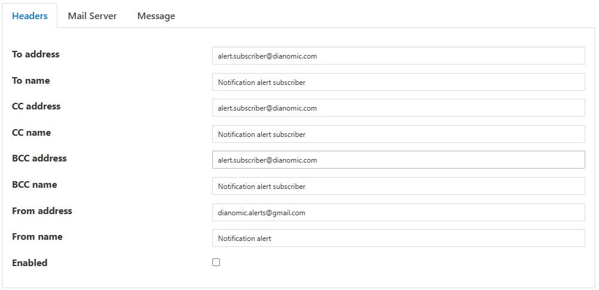
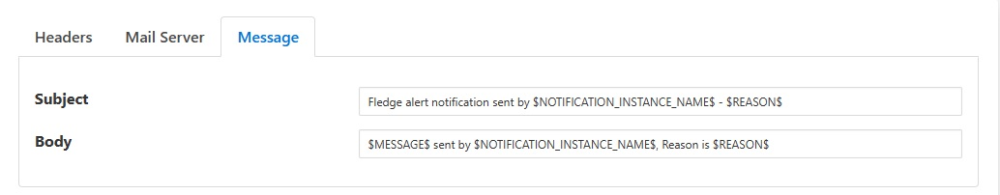

.. Images

  

Email Notifications
===================

The *fledge-notify-email* delivery notification plugin allows notifications to be delivered as email messages. The plugin uses an SMTP server to send email and requires access to this to be configured as part of configuring the notification delivery method.

During the creation of your notification select the email notification plugin from the list of available notification mechanisms. You will be prompted with a configuration dialog in which to enters details of your SMTP server and of the email you wish to send.

+-----------+
| |email_1| |
+-----------+

  - **To address**: The comma separated list of email addresses to which the notification will be sent

  - **To name**: The comma separated list of textual names for the recipient of the email

  - **CC address**: The comma separated list of email addresses to which the notification will be CCed

  - **CC name**: The comma separated list of textual names for the CC recipient of the email

  - **BCC address**: The email address to which the notification will be sent

  - **BCC name**: The comma separated list of email addresses to which the notification will be BCCed

  - **From address**: A from address to use for the email message

  - **From name**: A from name to include in the email

+-----------+
| |email_2| |
+-----------+

  - **Subject**: A Subject to put in the email message. Macro $NOTIFICATION_INSTANCE_NAME$ can be used in subject to provide information about notification instance name. Macro $REASON$ can be use to provide the reason for notification.

  - **Body**: A message to put in the email message. Macro $MESSAGE$ can be used to provide text message received from service. Macro $NOTIFICATION_INSTANCE_NAME$ can be used to provide information about notification instance name. Macro $REASON$ can be use to provide the reason for notification.

+-----------+
| |email_3| |
+-----------+

  - **SMTP Server**: The address of the SMTP server to which to send messages

  - **SMTP Port**: The port of your SMTP server

  - **SSL/TLS**: A toggle to control if SSL/TLS encryption should be used when communicating with the SMTP server

  - **Username**: A username to use to authenticate with the SMTP server

  - **Password**: A password to use to authenticate with the SMTP server.

 
